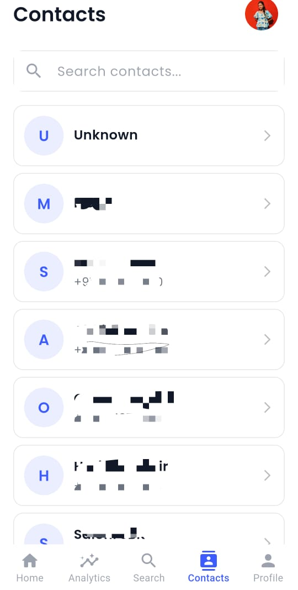

# 📚 Books Discovery App

A Flutter-based mobile application that allows users to discover and explore books easily.  
The app is built with clean architecture, proper state management, and Firebase integration.

---

## ✨ Features
- Browse and search books  
- Firebase Authentication (Email/Password)  
- State management with **Riverpod**  
- Modern, responsive, and lightweight UI  
- Cross-platform support (Android, iOS)  

---

## 📸 Screenshots
Add your app screenshots inside a folder named `screenshots/` 
## 📸 Screenshots

  
  
  
  
  
  
  

## 🧩 State Management
The app uses **Riverpod** for managing state.  

- `bookListProvider` → Handles fetching and storing books  
- `authProvider` → Manages Firebase user authentication state  
- `uiProvider` → Updates the UI reactively when data changes  

This approach makes the app more scalable, testable, and easy to maintain.  

---

## ⚠️ Assumptions & Limitations
- App requires an active internet connection (no offline support yet).  
- Optimized for Android; iOS not tested extensively.  
- Firebase Auth includes only Email/Password (no social logins yet).  

---

## 📦 APK (Production Build)
A release APK can be found at:  
https://drive.google.com/drive/folders/1sHOUv9uS3zsITQ1UTusqQfeIscQmaoZd?usp=sharing
